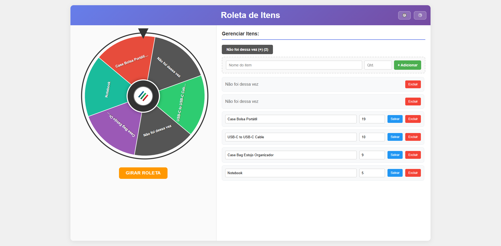
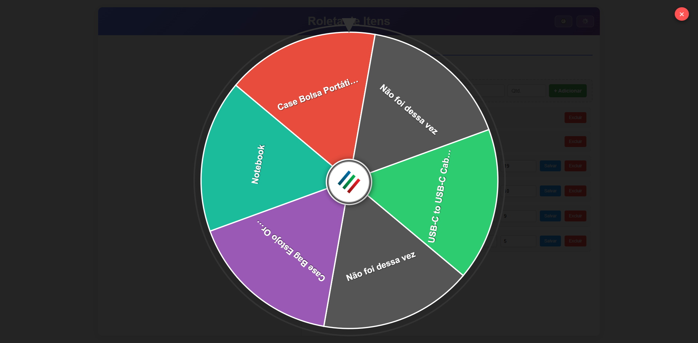

# Roleta de Itens

Aplicação de sorteio com roleta visual para distribuição de brindes / prêmios / escolhas aleatórias.

Características principais:
- Interface moderna com roleta animada (5s, múltiplas voltas, parada suave).
- Placeholders "Não foi dessa vez" (antes chamados internamente de `Nenhum item`).
- Itens com quantidade (decremento automático ao ser sorteado) – itens com quantidade 0 continuam visíveis porém não são escolhidos.
- Probabilidade global ajustável entre Itens reais e Placeholders via slider (%).
- Histórico dos últimos resultados (20) com distinção de acertos e “não foi dessa vez”.
- Efeitos visuais: confete (ganho), nuvem/escurecimento (placeholder), destaque do segmento vencedor.
- Modo fullscreen imersivo preservando o estado atual da rotação.
- Suporte opcional a logo central personalizada (`src/frontend/img/logo.png`).
- Persistência automática (SQLite no Electron + migração de `itens.txt`).
- Fallback para LocalStorage / arquivo texto quando o módulo nativo não está presente.

## Capturas de Tela

Tela principal:



Roleta em fullscreen:



> Substitua os arquivos `docs/img/tela-principal.png` e `docs/img/tela-fullscreen.png` pelas imagens fornecidas. Os nomes podem ser diferentes; ajuste os caminhos se necessário.

Persistência (Electron): **SQLite (`roleta.db`) em `userData`** com migração automática de versões antigas que usavam `itens.txt`.
No modo servidor/web simples, ainda há suporte legado a `itens.txt` e fallback LocalStorage.

## Execução

### Modo Servidor (Web)
```powershell
npm install
npm start
# Abrir http://localhost:3000
```

### Modo Desktop (Electron)
```powershell
npm run electron
```

### Build Executável (Windows)
```powershell
npm run dist
```
Saída: pasta `roleta/` (subpasta `win-unpacked/`).

## Estrutura
```
index.html
src/
	frontend/
		js/ (itemsStore.js, wheel.js, main.js)
		css/ (styles.css)
	electron/ (electron-main.js, preload.js)
	server/ (server.js)
itens.txt
package.json
README.md
CHANGELOG_CLEANUP.md
```

## Conceitos Principais
- Placeholders: identificados internamente como `Nenhum item`, exibidos como “Não foi dessa vez” e nunca decrementam quantidade.
- Probabilidades: slider define `%` do conjunto de itens reais; placeholders recebem `100 - %`. Se um grupo estiver vazio, 100% vai para o outro.
- Itens zerados: continuam visíveis na roda para contexto, mas têm peso 0 (não são sorteados).
- Intercalação: tentativa de alternar itens reais e placeholders na ordem de desenho.
- Migração: `itens.txt` legado migrado automaticamente para SQLite (arquivo renomeado para `.bak`).
- Persistência Web fallback: LocalStorage se API/servidor indisponível.
- Animação: 5s, múltiplas voltas (7–9) com deslocamento interno para evitar paradas exatas em linhas.
- Fullscreen: estado preservado ao entrar/sair.
- Feedback visual & histórico: confete, nuvem, destaque, toasts e registro (20 últimos resultados).

## Persistência

| Ambiente | Mecanismo | Caminho |
|----------|-----------|---------|
| Electron | SQLite | `%APPDATA%/Roleta de Itens/roleta.db` |
| Electron (primeira execução legado) | Migração de `itens.txt` | Renomeia para `itens.txt.bak` |
| Servidor Express | Arquivo texto | `./itens.txt` |
| Web estático | LocalStorage | Navegador |

Schema SQLite:
```
meta(id INTEGER PRIMARY KEY CHECK(id=1), item_chance_percent INTEGER)
items(name TEXT PRIMARY KEY, quantity INTEGER)
```

## Formato do Arquivo `itens.txt` (Legado / Fallback)
```
# Formatos legados ainda suportados para retrocompatibilidade (convertidos na carga):
#probItem=100
#probNone=100
Item A:3
Item B:1
Nenhum item:0
Nenhum item 2:0
```
Notas:
- Arquivos antigos com `#probItem/#probNone` são convertidos em um único percentual (proporção item vs placeholder).
- Placeholders continuam com quantidade 0.

## Scripts Disponíveis
| Script | Descrição |
|--------|-----------|
| `npm start` | Inicia servidor Express (usa `itens.txt`) |
| `npm run dev` | Inicia servidor Express com nodemon (se reativado) |
| `npm run electron` | Executa versão desktop (SQLite) |
| `npm run dist` | Gera build Windows via electron-builder |

## Próximos Passos Recomendados
1. Adicionar ESLint + Prettier.
2. Testes unitários (intercalação, pesos, normalizeMeta, offset de giro).
3. GitHub Actions para build/release automatizado.
4. Bundler (Vite/Rollup) para otimização.
5. Export / import de configuração (JSON) da lista de itens.
6. Opção de remover automaticamente itens zerados após X giros.

## Solução de Problemas
| Problema | Causa | Ação |
|----------|-------|------|
| Nada salva (web) | Acesso direto via file:// | Usar servidor http (npm start) |
| Não encontro roleta.db | Nunca abriu em Electron ainda | Rodar `npm run electron` uma vez |
| itens.txt sumiu no Electron | Migração para SQLite ocorreu | Ver `%APPDATA%/Roleta de Itens/roleta.db` |
| Janela Electron em branco | Arquivos fora do pacote | Conferir seção `build.files` no `package.json` |
| Porta 3000 ocupada | Processo antigo Node ativo | Finalizar processo (Stop-Process) |
| Acentos estranhos | Encoding incorreto | Garantir UTF-8 no arquivo |
| Logo não aparece | `logo.png` ausente ou nome diferente | Colocar `src/frontend/img/logo.png` e recarregar |
| Placeholder sumiu da roda | Todos removidos manualmente | Adicionar novamente via botão “Não foi dessa vez (+)” |

## Licença
Uso interno / didático.
